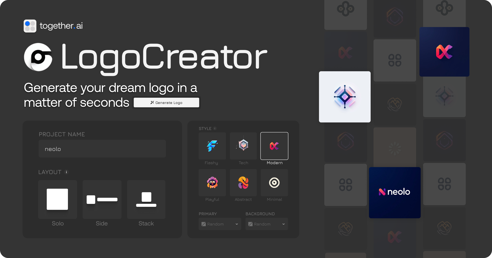

<a href="https://www.aicreator.cn">
  
  <h1 align="center">AI 创作助手</h1>
</a>

  开源的 AI 创作平台 – 轻松创作壁纸、Logo、儿童绘本和插画。

## 技术栈

- [API.Airforce](https://api.airforce) 用于图像生成
- [Next.js](https://nextjs.org/) 和 TypeScript 构建应用框架
- [Shadcn](https://ui.shadcn.com/) UI 组件 & [Tailwind](https://tailwindcss.com/) 样式
- [Upstash Redis](https://upstash.com/) 用于速率限制
- [Clerk](https://clerk.com/) 用于身份认证
- [Plausible](https://plausible.io/) & [Helicone](https://helicone.ai/) 用于分析和监控

## 功能特点

- 🎨 多种创作类型：壁纸、Logo、儿童绘本、插画
- 🎯 丰富的风格选择
- 📐 灵活的尺寸比例
- 🤖 多种 AI 模型可选
- 💫 智能提示优化
- 🔒 安全的用户认证
- 📊 使用次数跟踪

## 本地运行

1. 克隆仓库: `git clone https://github.com/yourusername/aicreator`
2. 创建 `.env` 文件并添加必要的环境变量
3. 运行 `npm install` 安装依赖
4. 运行 `npm run dev` 启动开发服务器

## 环境变量
